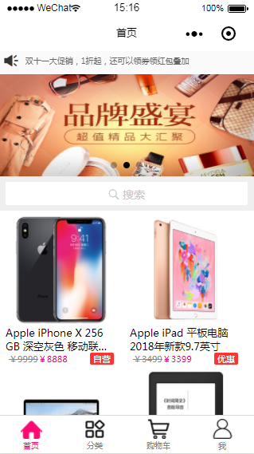
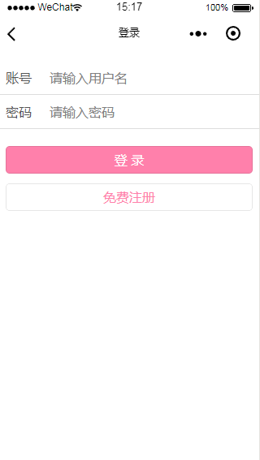
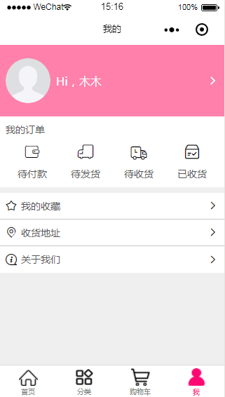
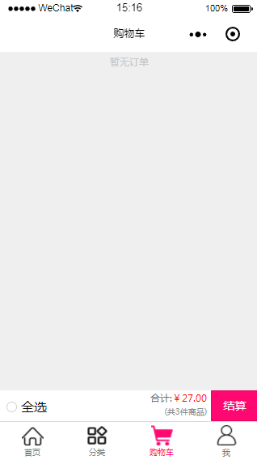

# uni-app

#### 项目介绍
制作了一个常见的购物小程序
功能：首页/轮播/公告/商品列表/购物车/收藏/订单状态/售后/
还有uni-app框架完成微信小程序、安卓、Ios三端开发

#### 项目截图

#### 小程序商城
项目描述
对公司的硬件：值班台、管理台、服务费、配件费，提供一个线上的入口;

产品服务人群：暂时是对内的，后续会开放面向代理商和渠道商

功能梳理：
  - 登录/注册忘记/密码
  - 商品分类：系列、类型
  - 选择商品：购物车、收藏
  - 支付商品：调用微信支付
  - 订单：代付款、待发货、待收货、已发货
  - 收货地址：添加、删除
  - 关于我们：公司介绍、电话拨打

开发周期：

    开发人数:1/开发周期:1个月
    
环境：

    windows 7
    
工具:

    Visual Studio Code/Node/Git/微信开发者工具/HBuilderX
    
项目架构：
  - uni-app框架使用HBuilderX进行编译打包
  - 框架集成了vue部分语法和事件绑定、页面跳转需要在pages.json中单独排至、数据可以使用vuex全局状态管理
  - 小程序组件库:完成页面布局、弹窗、轮播、下拉刷新、上拉加载更多
  - 框架有自己的一套生命周期钩子函数
 
工作职责
  - 这个项目是独立开发的,现阶段只开发了一周、完成了首页、购物车，分类、我的、登录、忘记密码页面布局
  - 因为商城项目大同小异，所以这个项目设计和原型参照了小程序换新百货和祥和百货
  - 项目主页面分为4个Tab页面，首页、分类、购物车、我的
  - 它这的模板是下载HBuilderX编辑器后自己集成的、预览项目需要借助第三方、
 app预览的话需要模拟器，因为是windows7所以只安装了安卓浏览器、小程序预览需要微信开发者工具

